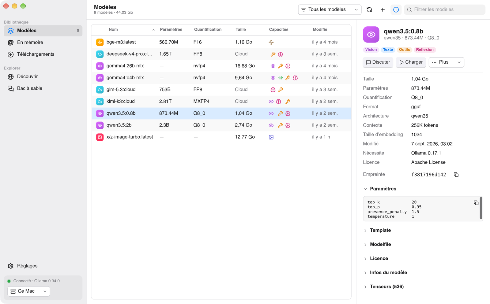
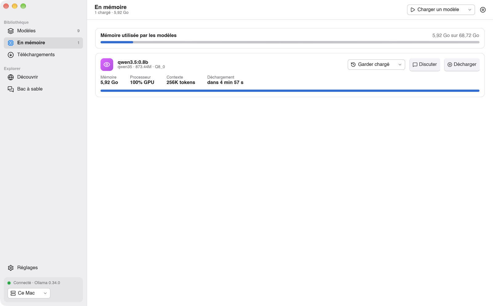
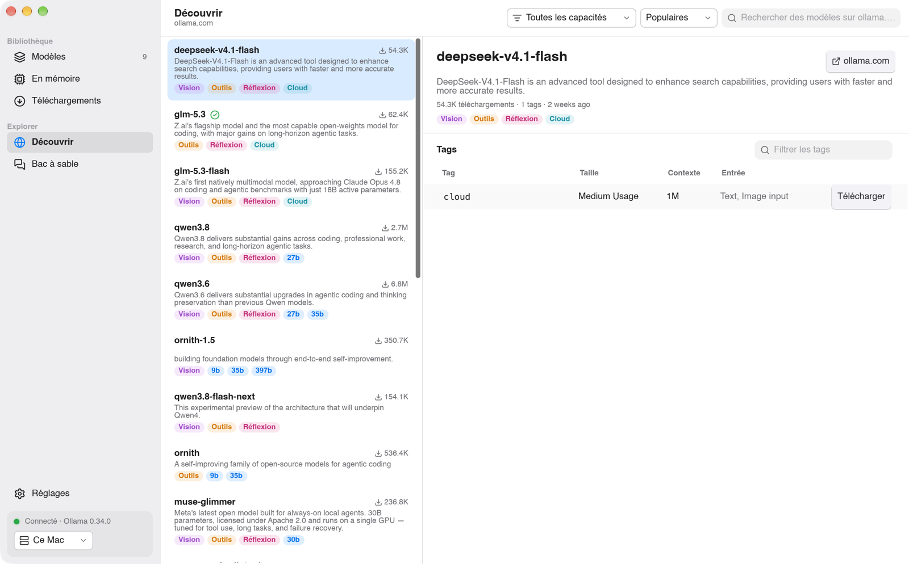
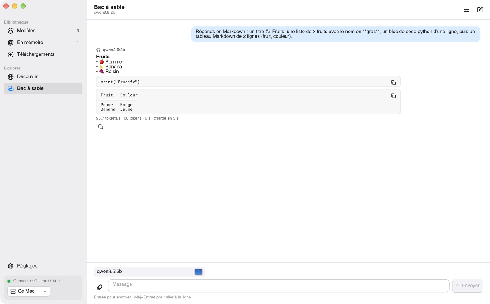

<p align="center">
  
</p>

<h1 align="center">Ollama GUI</h1>

<p align="center">
  A desktop app for <b>macOS</b> and <b>Windows</b> to manage your <a href="https://ollama.com">Ollama</a> models.<br>
  Browse, pull, update, inspect, load, customize and test models without the terminal.
</p>

<p align="center">
  <a href="https://github.com/Hugo291/ollama-gui/releases/latest/download/OllamaGUI-macOS.zip"><b>Download for macOS</b></a> ·
  <a href="https://github.com/Hugo291/ollama-gui/releases/latest/download/OllamaGUI-Windows-Setup.exe"><b>Download for Windows</b></a> ·
  <a href="https://hugo291.github.io/ollama-gui/">Website</a> ·
  <a href="#français">Français</a>
</p>



## Features

**Models**
- Every installed model with its size, parameters, quantization, capabilities (vision, tools, thinking, embedding, image, audio) and cloud or local origin. Sortable, searchable, filterable.
- Inspector with the full configuration: parameters, system prompt, template, Modelfile, license, model info and tensors.
- **Update check** against the Ollama registry (compares manifest digests, nothing is downloaded) and one-click update of one or all outdated models.
- Duplicate, rename, **customize** (a new model on top of an existing one, with its own system prompt, temperature, context window, top P and seed) and delete.

**Downloads and library**
- Pull any model (`gemma3`, `qwen3:8b`, `hf.co/…`) with live progress, speed and time remaining; cancel and retry.
- **Discover** the ollama.com library: search, filter by capability, sort by popularity or date, browse every tag with its size and context window, and pull in one click.

**Memory**
- Loaded models with memory used, CPU/GPU split, context size and a countdown to unload.
- Load, unload or keep a model loaded longer. Models are never pinned in memory forever: the app always sends a finite keep-alive (5 minutes by default, 1 minute to 1 hour in Settings).

**Playground**
- Streaming chat to try a model, with tokens per second, token count and load time. Replies are rendered as Markdown, with code blocks and tables.
- Reasoning output for thinking models, image attachments for vision models, system prompt, temperature and context window.

**And also**
- Several Ollama servers (this computer, a machine on your network, a remote host) with a quick switcher.
- Menu bar icon (macOS) or notification area icon (Windows) with the loaded models and active downloads.
- Light and dark themes, English and French.

| Running models | Discover | Playground |
| --- | --- | --- |
|  |  |  |

## Install

Install and start [Ollama](https://ollama.com/download) first, on this computer or on a machine the app can reach.

**macOS** (11 Big Sur or later, Apple silicon or Intel)
1. Download [`OllamaGUI-macOS.zip`](https://github.com/Hugo291/ollama-gui/releases/latest/download/OllamaGUI-macOS.zip), unzip it and move **Ollama GUI** to your Applications folder.
2. The app is signed ad hoc, not notarized: the first time, right-click it and choose **Open**, or run:

```bash
xattr -dr com.apple.quarantine "/Applications/Ollama GUI.app"
```

**Windows** (10 or 11, 64-bit)
1. Download and run [`OllamaGUI-Windows-Setup.exe`](https://github.com/Hugo291/ollama-gui/releases/latest/download/OllamaGUI-Windows-Setup.exe). It installs for the current user, no administrator rights needed.
2. The installer is not code-signed: if SmartScreen warns you, choose **More info → Run anyway**.

A portable `OllamaGUI-Windows-Portable.exe` is also attached to each [release](https://github.com/Hugo291/ollama-gui/releases/latest).

## Build from source

Requires [Rust](https://rustup.rs) 1.88 or later.

```bash
git clone https://github.com/Hugo291/ollama-gui.git
cd ollama-gui
cargo run --release
```

Run the tests:

```bash
cargo test
```

Packaging:
- macOS: `scripts/build-macos.sh` builds a universal `dist/Ollama GUI.app` and `dist/OllamaGUI-macOS.zip`.
- Windows: `cargo build --release` embeds the icon in `ollama-gui.exe`; `iscc packaging\windows\installer.iss` ([Inno Setup](https://jrsoftware.org/isinfo.php)) builds the installer.
- CI builds, tests and smoke-tests both platforms on every push, and attaches the builds to the release when a `v*` tag is pushed.

Translations live in `lang/<language>/LC_MESSAGES/ollama-gui.po`. After changing interface strings, run `scripts/update-po.py` to add new strings to the French file (it lists the ones left to translate). Strings composed in Rust are in `src/app/text.rs`.

## How it works

- Everything goes through the [Ollama REST API](https://docs.ollama.com/api) of the selected server (`/api/tags`, `/api/ps`, `/api/show`, `/api/pull`, `/api/create`, `/api/copy`, `/api/delete`, `/api/chat`).
- **Updates**: the digest of a local model is the SHA-256 of its manifest. The app asks `registry.ollama.ai` for the digest of the current manifest (a `HEAD` request) and compares.
- **Discover**: ollama.com has no public search API, so the app reads its public search and tags pages. If the site layout changes, Discover may show fewer details until the parser is updated; pulling by name always works.
- **Servers**: an address without a port uses Ollama's default port 11434 (`192.168.1.20` → `http://192.168.1.20:11434`). The `OLLAMA_HOST` environment variable sets the default server.

| Path | Content |
| --- | --- |
| `src/api` | Ollama API client, registry update checks, ollama.com parser, formatting (unit tested) |
| `src/app` | Controller: state, refresh, downloads, Discover, Playground, Markdown rendering, tray icon |
| `ui` | Interface in [Slint](https://slint.dev): native-looking widgets on each platform (Cupertino on macOS, Fluent on Windows) |
| `lang` | Translations (gettext) |
| `packaging` | macOS `Info.plist` and icon, Windows icon and installer script |
| `legacy/macos-swift` | Version 1, a SwiftUI app for macOS |

## Privacy

No analytics, no account. The app only talks to the Ollama servers you configure, plus `ollama.com` when you open Discover and `registry.ollama.ai` when you check for updates.

## Français

**Ollama GUI** est une app pour macOS et Windows qui gère vos modèles Ollama : liste des modèles installés (taille, paramètres, quantification, capacités), détails complets, **recherche de mises à jour** sur le registre Ollama, téléchargement avec progression, bibliothèque ollama.com (recherche, tags, téléchargement en un clic), modèles en mémoire (chargement, déchargement, compte à rebours), duplication, renommage, **personnalisation** (prompt système et paramètres), suppression, et un **bac à sable** pour discuter avec un modèle et mesurer sa vitesse. Plusieurs serveurs, icône dans la barre des menus (macOS) ou la zone de notification (Windows), thèmes clair et sombre, interface en français et en anglais.

Installation :
- **macOS** : téléchargez [`OllamaGUI-macOS.zip`](https://github.com/Hugo291/ollama-gui/releases/latest/download/OllamaGUI-macOS.zip), dézippez, glissez l'app dans Applications, puis clic droit → **Ouvrir** au premier lancement (app non notarisée).
- **Windows** : lancez [`OllamaGUI-Windows-Setup.exe`](https://github.com/Hugo291/ollama-gui/releases/latest/download/OllamaGUI-Windows-Setup.exe) (sans droits administrateur). Si SmartScreen s'affiche : **Informations complémentaires → Exécuter quand même**.

## License

[MIT](LICENSE). Ollama GUI is an independent project, not affiliated with Ollama.

The interface is built with [Slint](https://slint.dev), used under the Slint Royalty-free License.

<a href="https://slint.dev"></a>
